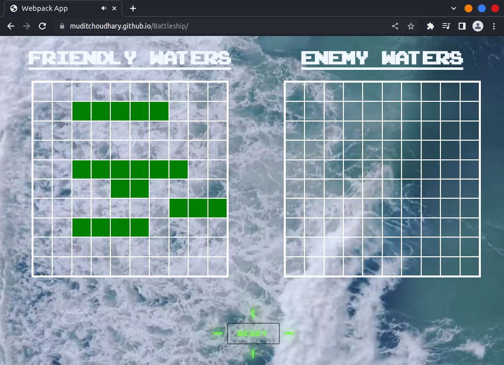

# Battleship

Classic Battleship game made with JavaScript. This project was part of TheOdinProject's Assignment. The main purpose of this project is to learn and practice Test Driven Development and jest.

## Images/Videos

<video src="Sample/sample-video.mp4"></video>

## Languages/Tools Used

-   Html, Css, JavaScrpt
-   Webpack, Jest, Es-ling, Prettier.

## What Did I learn?

-   What is TDD?
-   How to build the project using TDD?
-   What is jest and how to use it for testing?

## Imporvments

-   Vertical Placement of ship could be implemented.
-   More Improved Computer attacks could be implemented.
-   Mobile responsiveness could be implemented.
-   Two-player mode could be implemented.
-   Better Code style and module structure could be implemented.
